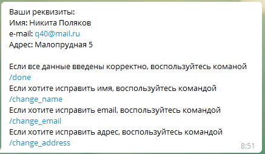
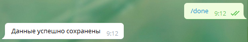
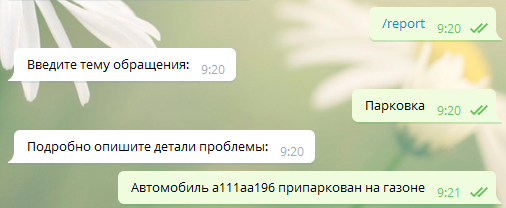
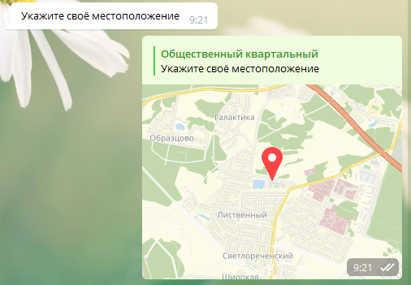
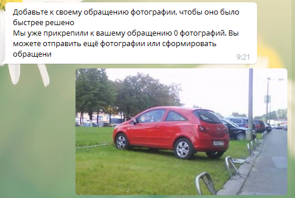
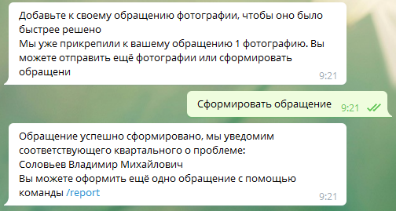
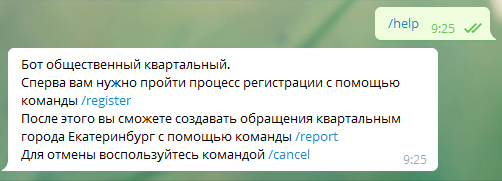
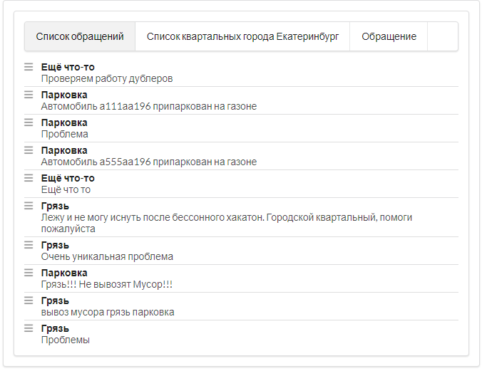
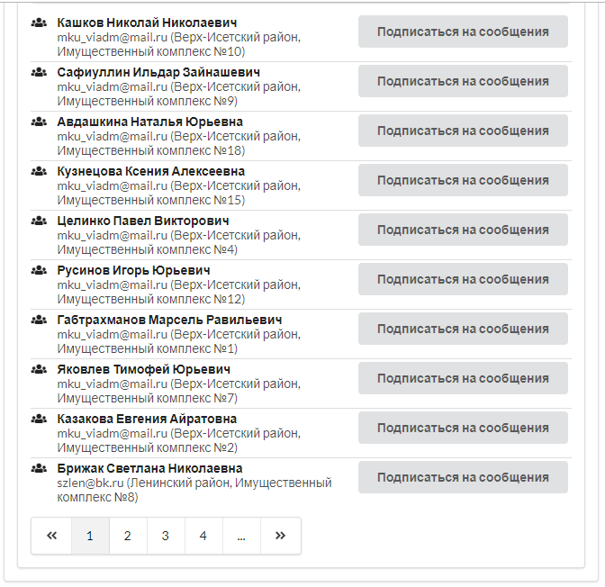
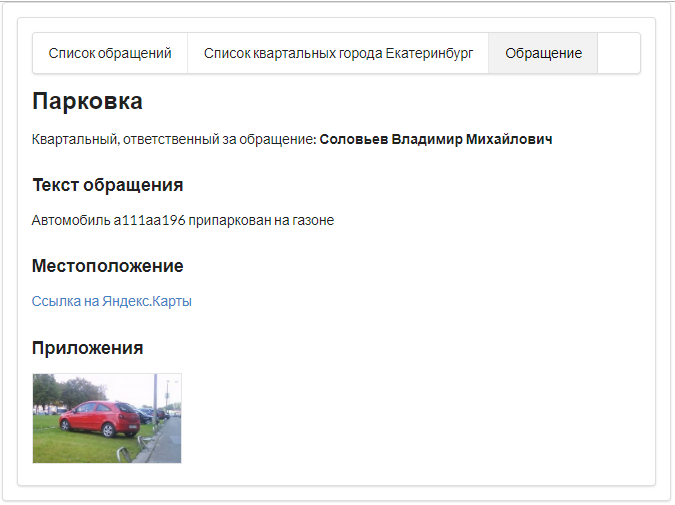

# Репозиторий проекта команды "OK" в рамках Урбатона
Состав команды:
1. Сивухин Никита - backend, проработка идеи.
2. Махно Алексей - архитектор, придумал идею.
3. Поляков Никита - накинул немного мишуры.
## Телеграм бот "Общественный квартальный" 
Ссылка: http://t.me/ok_ekb_bot  
Адресс: @ok_ekb_bot    
Веб интерфейс: http://68.183.45.217    
Данный телеграм бот предоставляет возможность быстро создать обращение к квартальному города Екатеринбург ответственному за территорию на которой создано обращение. Список квартальных формируется динамически.
## Основные команды меню
1. **/register** - Регистрация пользователя в системе.
2. **/report** - Сформировать обращение к квартальному.
3. **/help** - Помощь.
    
### Регистрация в системе
Для прозрачности отправляемых сообщений и получения обратной связи, предполагается регистрация в системе.
Воспользуйтесь командой **/register**.
И следуйте инструкциям бота:
    
Дальше бот предложит подтвердить информацию о себе или внести изменения:    
    
Подтверждение информации:   
   
       
### Формирование обращения к квартальному
Для формирования обращения воспользуйтесь командой **/report**.  
И следуйте инструкция бота:  
   
   
   
   
    
### Помощь
Для получения подсказок по работе с ботом воспользуйтесь командой **/help**   

  
## Обеспечение гласности
Для обеспечения гласности реализован веб интерфейс по адресу http://68.183.45.217.  
Список обращений:  
   
Список квартальных:   
     
Выбранное обращение:   

